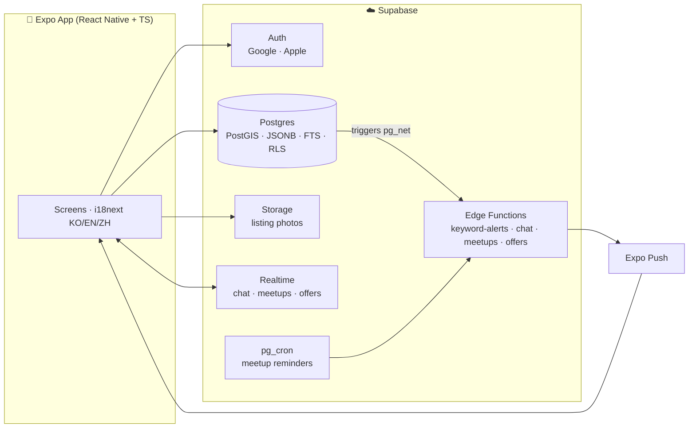

# Torrens Market 🛒

**Trilingual (한국어 / English / 中文) secondhand marketplace for Adelaide.**
Named after Adelaide's River Torrens. Built with React Native + Expo + TypeScript on Supabase.

> Adelaide's international residents trade on Facebook Marketplace and Gumtree — no proper mobile UX, no trust system, English only. Torrens Market is a Karrot(당근마켓)-inspired local marketplace built for the city's Chinese, Korean, and international communities.

## Why this exists

| Problem today | Torrens Market |
|---|---|
| Facebook Marketplace: clunky filters, no dedicated app UX | Native app, distance-first feed, structured filters |
| English-only platforms in a multilingual city | Full KO/EN/ZH UI switching from day one |
| No way to trade within your community | Self-declared nationality + opt-in community filter |
| No trust signals, scam-prone | Phone-verification badge + verified-only filter |
| Free-text listings hide key details | **Category-specific structured fields** — furniture dimensions, cosmetics expiry, car rego & service history |

## Features

**Trading**
1. Listing creation with multi-photo upload, **category-specific fields** (12 categories) and title-based category suggestion
2. Feed with location scope (my suburb / within 5–20 km / all), distance on cards, pickup-only badges, favorite counts
3. Search — FTS + category / nationality / verified / max-price filters, recent-search memory
4. Favorites, **keyword alerts** (push when a matching listing is posted), listing **bump** (once a day, DB-enforced), edit & soft delete

**Trust & safety**
5. Email OTP sign-in (social login wired, pending provider config) + phone-verification badge
6. **Aussie-animal trust tiers** — quokka → bilby → koala → wombat → wallaby → kangaroo, computed in-DB from post-trade reviews (1 per side per listing, RLS-gated)
7. GPS **suburb verification** badge; listings store only ~1.1 km-fuzzed coordinates (privacy by construction)
8. Report / block — blocking hides listings and refuses new chats

**Deal-making (all in chat)**
9. 1:1 realtime chat with unread badges and message push (recipient's language)
10. **Meetup scheduling** — propose time+place, accept/decline, push + 1-hour pg_cron reminder; accepting reserves the listing, cancelling releases it
11. **Price offers** — one open offer per room, accept/decline/withdraw, push notified

**Platform**
12. Chat photos (private room-scoped bucket), public seller profiles, listing view counts, account deletion ([privacy policy](PRIVACY.md))
13. Auto-moderation: 3 distinct reports hide a listing; blocking gates chat both ways
14. Trilingual UI — 185 keys × KO/EN/ZH, per-recipient push language
15. 46-step live E2E journey suite (`scripts/e2e-journey.mjs`) covering flows *and* RLS negative cases, plus GitHub Actions CI

## Architecture



Key design choices (each recorded as an ADR in [`docs/adr/`](docs/adr/)):

- **[ADR 001](docs/adr/001-cross-platform-framework.md)** — React Native + Expo + TypeScript: one codebase for Android/iOS with a real path to a SEO-capable web version
- **[ADR 002](docs/adr/002-auth-strategy.md)** — trust as a *badge + filter*, not a sign-up gate
- **[ADR 003](docs/adr/003-backend-supabase.md)** — Supabase now, extraction path later; keyword-alert matching is a custom-built service
- **[ADR 006](docs/adr/006-approximate-location-distance.md)** — coordinates fuzzed at capture; distance computed on-device
- **[ADR 008](docs/adr/008-trust-tiers.md)** — the quokka→kangaroo trust ladder, tamper-proof in the DB
- **[ADR 009](docs/adr/009-meetup-scheduling.md)** / **[ADR 011](docs/adr/011-price-offers.md)** — deal-making state machines in chat
- **[ADR 010](docs/adr/010-listing-bump.md)** — once-a-day bump with a server-time RPC (an E2E-caught clock-skew fix)

## Documentation map

| Read this | To understand |
|---|---|
| [docs/database.md](docs/database.md) | **The entire data layer on one page** — tables by domain, design patterns, all 29 migrations |
| [docs/security.md](docs/security.md) | **The security architecture** — RLS model, definer surface, privacy, abuse defense, audit log |
| [SECURITY.md](SECURITY.md) / [PRIVACY.md](PRIVACY.md) / [TERMS.md](TERMS.md) | Vulnerability reporting / privacy policy / terms of service |
| [Public site](https://it-yun.github.io/torrens-market/) | Store-facing landing, [privacy](https://it-yun.github.io/torrens-market/privacy.html) & [support](https://it-yun.github.io/torrens-market/support.html) pages (GitHub Pages) |
| [docs/adr/](docs/adr/) | 14 decision records — *why* each choice was made, with alternatives |
| [docs/mvp-spec.md](docs/mvp-spec.md) · [categories](docs/categories.md) · [scenarios](docs/user-scenarios.md) · [data-model](docs/data-model.md) | The original product/design phase docs |

## Security

Authorization is enforced **in the database**, never in the client — the app ships only the public Supabase URL + anon key, which are safe *because* Row-Level Security is the real gate ([SECURITY.md](SECURITY.md)).

- **RLS on every table**, proven by an attack-simulation suite: cross-tenant reads/writes, BOLA (broken object-level authorization), and mass-assignment. Example caught & fixed: column-level privileges now prevent a client from self-assigning the phone-verification badge.
- **No secrets in the repo or bundle** — `service_role` and third-party keys live only in server-side env; verified by full-history secret scanning.
- **Trust badges & trade state are server-managed**; **coordinates fuzzed on-device** (~1.1 km) so exact GPS never leaves the phone.
- **CI security gates**: gitleaks (secret scan), CodeQL (JS/TS static analysis), `npm audit` + Dependabot.

## Status

- [x] Product planning — benchmarked Karrot, Bunjang, Gumtree feature-by-feature
- [x] Design — screens, user scenarios, ERD, ADRs 001–003
- [x] M1: auth + profiles (social login pending provider config; email OTP live)
- [x] M2: listings + category fields + photo upload
- [x] M3: search + filters + favorites
- [x] M4: realtime chat
- [x] M5: keyword alerts (Edge Function matcher + Expo push)
- [x] Reviews + trust tiers, meetups, price offers, bump, edit/delete, message push
- [x] Live E2E journey suite (46 steps incl. RLS negative tests) — ALL PASS + CI
- [ ] M6: device QA, EAS builds, store release (App Store / Play Store)

## Running locally

```bash
npm install
npx expo start        # then i (iOS simulator) / a (Android) / scan QR with Expo Go
```

## License

[MIT](LICENSE) © 2026 Seung Yun Lee
