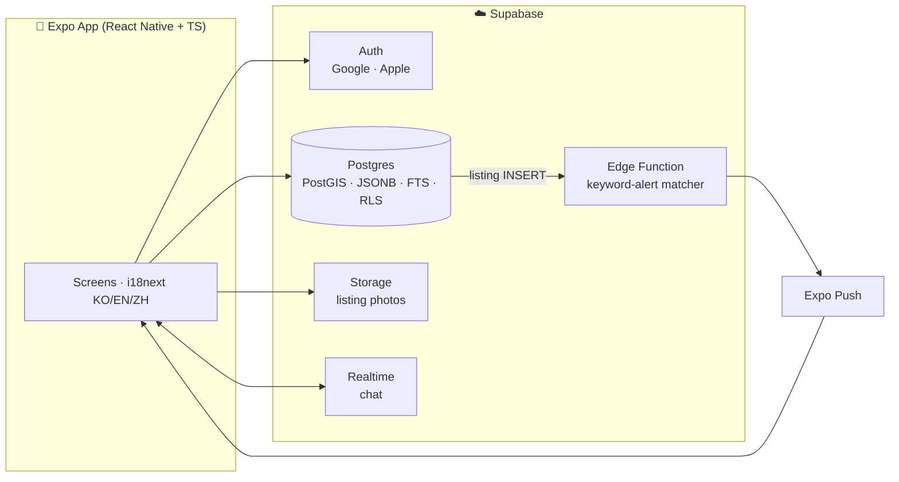

# Torrens Market 🛒

**Trilingual (한국어 / English / 中文) secondhand marketplace for Adelaide.**
Named after Adelaide's River Torrens. Built with React Native + Expo + TypeScript on Supabase.

> Adelaide's international residents trade on Facebook Marketplace and Gumtree — no proper mobile UX, no trust system, English only. Torrens Market is a Karrot(당근마켓)-inspired local marketplace built for the city's Chinese, Korean, and international communities.

## Why this exists

| Problem today | Torrens Market |
|---|---|
| Facebook Marketplace: clunky filters, no dedicated app UX | Native app, distance-first feed, structured filters |
| English-only platforms in a multilingual city | Full KO/EN/ZH UI switching from day one |
| No way to trade within your community | Self-declared nationality + opt-in community filter |
| No trust signals, scam-prone | Phone-verification badge + verified-only filter |
| Free-text listings hide key details | **Category-specific structured fields** — furniture dimensions, cosmetics expiry, car rego & service history |

## MVP features

1. Social sign-in (Google/Apple) + optional phone verification badge
2. Listing creation with frictionless multi-photo upload
3. **Category-specific fields** — picking a category reveals tailored inputs (10 categories, 5 with custom field sets)
4. Browse & search — category / distance (PostGIS) / nationality / verified filters
5. Favorites
6. **Keyword alerts** — push notification when a matching listing is posted
7. 1:1 realtime chat with pickup-mode context
8. Trilingual UI (i18next)

## Architecture



Key design choices (each recorded as an ADR in [`docs/adr/`](docs/adr/)):

- **[ADR 001](docs/adr/001-cross-platform-framework.md)** — React Native + Expo + TypeScript: one codebase for Android/iOS with a real path to a SEO-capable web version
- **[ADR 002](docs/adr/002-auth-strategy.md)** — trust as a *badge + filter*, not a sign-up gate
- **[ADR 003](docs/adr/003-backend-supabase.md)** — Supabase now, extraction path later; keyword-alert matching is a custom-built service

Full product/design docs: [`docs/`](docs/) — MVP spec, category field system, user scenarios, 9-table ERD.

## Status

- [x] Product planning — benchmarked Karrot, Bunjang, Gumtree feature-by-feature
- [x] Design — screens, user scenarios, ERD, ADRs 001–003
- [x] M1: auth + profiles (social login pending provider config; email OTP live)
- [x] M2: listings + category fields + photo upload
- [x] M3: search + filters + favorites
- [x] M4: realtime chat
- [x] M5: keyword alerts (Edge Function matcher + Expo push)
- [ ] M6: device QA, EAS builds, store release (App Store / Play Store)

## Running locally

```bash
npm install
npx expo start        # then i (iOS simulator) / a (Android) / scan QR with Expo Go
```

## License

[MIT](LICENSE) © 2026 Seung Yun Lee
