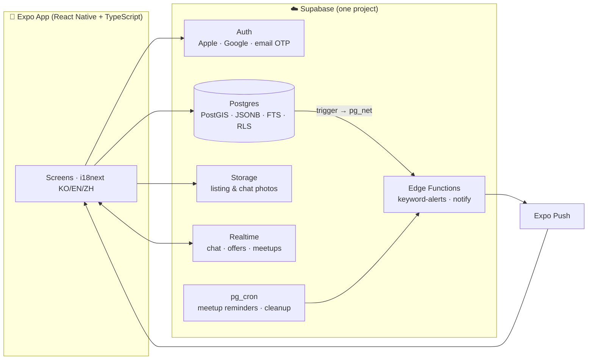

# Architecture

This is the "how it all fits together" tour of Torrens Market. If you only read one design doc, read this one — it explains the shape of the system and, more importantly, *why* it's shaped that way. The per-decision detail lives in the [ADRs](adr/); this is the map that ties them together.

## The one-sentence version

**A React Native (Expo) app talks directly to a single Supabase project, and every security rule that matters is enforced in the Postgres database — not in the app.** That one principle drives almost every other decision here.

## Why "the client is hostile"

The app ships with a public Supabase URL and a public "anon" key baked into the JavaScript bundle. Anyone can extract those and make their own requests with `curl`. So I designed the whole system on one assumption: **the client cannot be trusted, and nothing the app "doesn't show" is actually protected.** Only what the *database* refuses to return is safe.

That's why authorization is **Row-Level Security (RLS)**. Every table in the `public` schema has RLS turned on, and each policy filters rows by `auth.uid()`. A buyer can read their own chats, offers, and favourites; they physically cannot read anyone else's, because the database won't hand those rows over — not to the app, not to `curl`, not to a modified client. The anon key is safe to ship *because* RLS is the real gate. This is verified, not just intended: there's an attack-simulation suite that logs in as two different users and tries every cross-tenant read and write; they all come back empty or rejected.

A nice consequence: the app code stays simple. It just asks for data; the database decides what it's allowed to see.

## The client (Expo + React Native + TypeScript)

One TypeScript codebase runs on iOS and Android, with a real path to a web build later ([ADR 001](adr/001-cross-platform-framework.md)). A few things worth calling out:

- **Trilingual from day one.** Korean, English, and Chinese aren't an afterthought — they're the product's reason to exist (Adelaide's Korean and Chinese communities currently trade in unsearchable KakaoTalk/WeChat groups). UI strings live in `i18next` (KO/EN/ZH), and category names / custom-field labels are stored trilingually in the database so they translate too. Push notifications even arrive in the recipient's language.
- **Sessions live in the device keychain.** Auth tokens go into `expo-secure-store` (iOS Keychain / Android Keystore), not plaintext storage, and old sessions are migrated forward automatically.
- **Distance is computed on-device.** More on this under "location privacy" below.

## The backend (one Supabase project)

I deliberately kept the backend to a single managed Supabase project rather than a fleet of microservices ([ADR 003](adr/003-backend-supabase.md)). At Adelaide's scale, one well-indexed Postgres is not the bottleneck — and Supabase is just Postgres, so nothing here locks me in. Here's what each piece does:

- **Postgres** is the heart. It holds every table, enforces every RLS policy, runs the trust-score computation as a view, and uses PostGIS for location, JSONB for per-category custom fields, and full-text search for listings.
- **Auth** handles Sign in with Apple, Google, and email one-time-codes. A database trigger (`handle_new_user`) creates the user's profile automatically on first sign-in, pulling their name and avatar from the OAuth provider.
- **Storage** holds photos. Listing photos are public (but served through a CDN and downscaled on the client before upload); chat photos live in a private, room-scoped bucket and are served via short-lived signed URLs so only the two participants can see them.
- **Realtime** powers live chat, price offers, and meetup proposals. It respects the same RLS policies, so you can only receive changes for rooms you're a participant in.
- **Edge Functions** run the things that don't belong in a client: the keyword-alert matcher and the push-notification senders.

## Three data flows that show how it works

**1. Posting a listing.** The app compresses photos on-device, rounds the GPS coordinates to a ~1.1 km grid, and inserts the row. RLS's `WITH CHECK` clause guarantees the `seller_id` is the logged-in user — you cannot post as someone else. Column-level grants guarantee you can't set server-managed fields like `view_count` or the phone-verified badge.

**2. A keyword alert firing.** This is the feature I'm proudest of, and it's a small custom notification service ([ADR 004](adr/004-keyword-alert-architecture.md)). When any listing is inserted, an `AFTER INSERT` trigger calls an Edge Function through `pg_net` (authenticated with a shared secret so nobody can spoof it). The function matches the new listing's title/description against every active keyword alert — case-insensitively — and fans out an Expo push to each matching user, in their language. I've watched a listing I inserted server-side land as a notification on a real phone a second later.

**3. A chat with an offer and a meetup.** Two users open a room (one row, both added as participants). Messages, price offers, and meetup proposals all live in that room and are gated by an `is_room_participant()` check — in RLS *and* in Realtime. Offers can be disabled per-listing (firm-price sellers), enforced right in the offers insert policy so a modified client still can't slip one through.

## Two design choices I want to highlight

**Location privacy by construction ([ADR 006](adr/006-approximate-location-distance.md)).** Your exact GPS never leaves your phone. The app rounds coordinates to a ~1.1 km grid *before* upload, and computes "0.3 km · 4 min walk" on-device from that fuzzed value. There's simply no precise location in the database to leak.

**Trust that can't be faked ([ADR 008](adr/008-trust-tiers.md)).** Sellers climb an Aussie-animal ladder — quokka → bilby → koala → wombat → wallaby → kangaroo — based on points computed *in the database* from post-trade reviews (a 5-star review is +1, a 1-2-star is −1). The app only maps points to a tier name for display; it can't award itself points, and the phone-verified badge is server-only too. The whole trust system is tamper-proof because it's computed where the client can't reach.

## Where to go next

- [docs/database.md](database.md) — the entire data layer on one page (tables, patterns, migrations)
- [docs/security.md](security.md) — the security model in depth (RLS, definer functions, abuse defense)
- [docs/operations.md](operations.md) — how it scales and how it survives an outage
- [docs/roadmap.md](roadmap.md) — where the product goes (monetization, new verticals)
- [docs/adr/](adr/) — every design decision, with the alternatives I weighed
