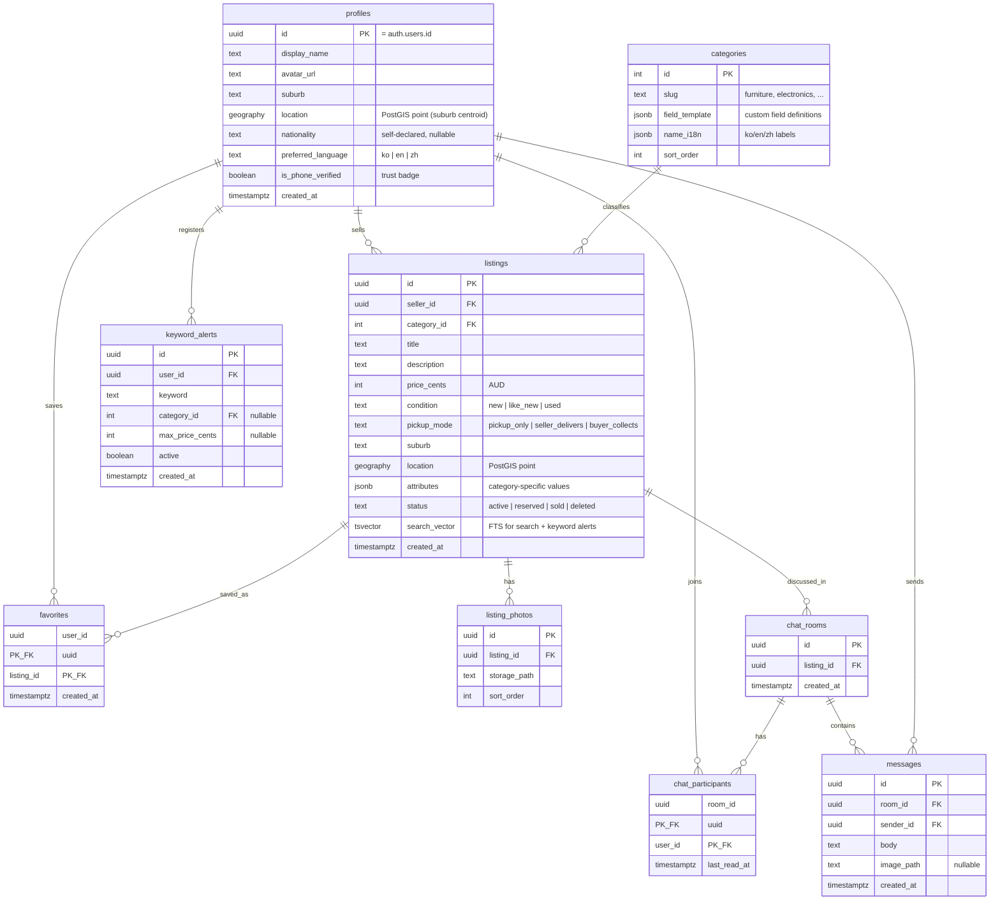

# Spec — Data Model (ERD)

Postgres on Supabase per `003-backend-supabase`. Covers every scenario in `spec-user-scenarios`.

## Design notes
- **Category custom fields**: `categories.field_template` defines each category's fields (type, label i18n, required); `listings.attributes` stores the values as JSONB → new categories/fields need no migration (`spec-categories`).
- **Distance filter**: `listings.location` (PostGIS) + GiST index → `ST_DWithin` for "within X km". Suburb centroid, not exact address (privacy).
- **Keyword alerts**: on listing INSERT, a trigger/Edge Function matches `search_vector` against active `keyword_alerts` → Expo push. This is the custom showcase service (`003-backend-supabase`).
- **Nationality filter**: join on `profiles.nationality`; NULL = not shown, always opt-in filter (`spec-mvp`).
- **i18n**: UI strings live in the app (i18next); DB stores `name_i18n` only for category labels. Listing content stays in the seller's language (machine translation of listings = v2 candidate).
- **RLS sketch**: listings readable by all / writable by seller; messages readable only by room participants; favorites/keyword_alerts owner-only. Full policies written at implementation.
- **Push tokens**: Expo push tokens stored per device in a small `push_tokens` table (omitted from diagram).
